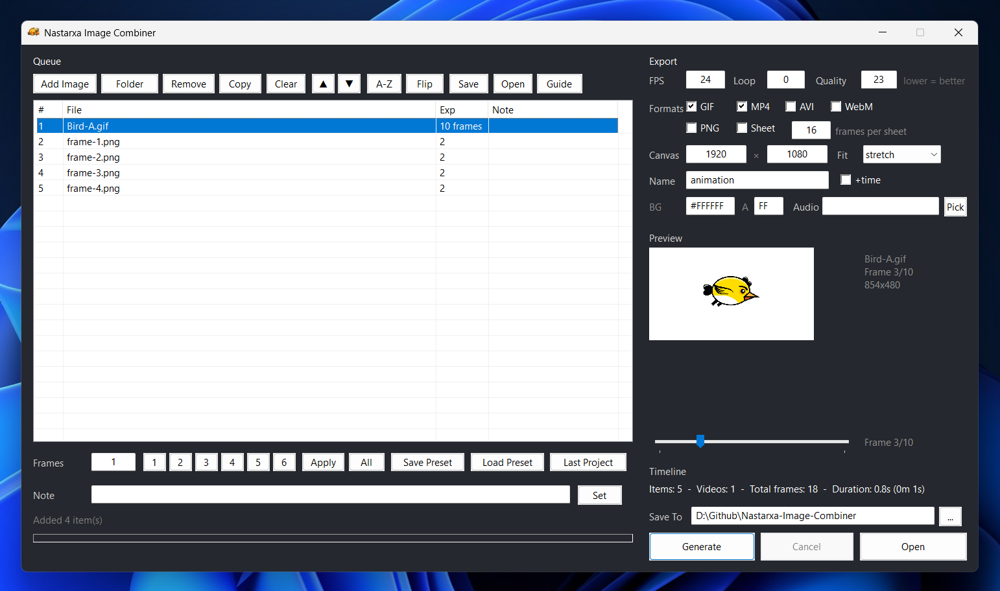
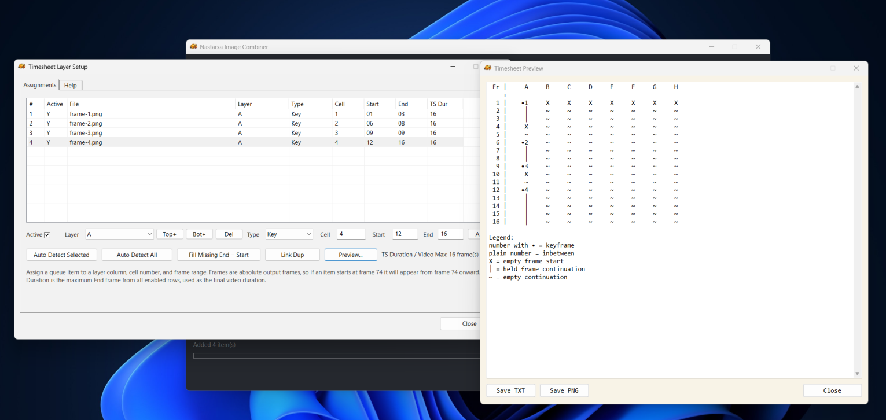

# 🎞️ Nastarxa Image Combiner

> 🎬 Animation and sequence builder for images and videos.

Combine images and MP4 clips into animations, image sequences, videos, and anime-style timesheets.


---

## 🖼 Image Preview




---

# ✨ Features

## 📂 Media Workflow

* Drag & drop files or folders
* Queue images, MP4 clips, and MOV clips
* Move, duplicate, remove, sort, and reverse items
* Per-item notes
* Undo / redo support

  * `Ctrl + Z`
  * `Ctrl + Shift + Z`

---

## 🎬 Standard Animation Workflow

* Frame/exposure-based timing
* Timeline duration preview
* Sequence generation
* Contact sheet export
* Multiple output formats

Supports:

* GIF
* MP4
* AVI
* WebM
* QuickTime MOV (transparent)
* PNG sequence
* Contact sheet

Designed for animation workflows, timing previews, and layer-based compositing.

---

# 🕒 Timesheet Mode (TS)

Enable `TS` mode for anime-style layer timing workflows.

When enabled:

* standard exposure timing is disabled
* queue reordering is disabled
* output is generated using timesheet layer timing

Each row supports:

| Field   | Description          |
| ------- | -------------------- |
| `Active`   | Enable / disable row |
| `Layer` | Layer assignment     |
| `Type`  | Timing type          |
| `Cell`  | Cell number          |
| `Start` | Start frame          |
| `End`   | End frame            |

---

## 🧩 Layer System

Default layers include:

```txt
A_shita   A   A_ue
B_shita   B   B_ue
C_shita   C   C_ue
...
H_shita   H   H_ue
```

### Layer Rules

* Base layers `A` → `H` cannot be deleted
* Custom layers can be added
* Custom layers can be deleted
* Duplicate cells inside the same layer are blocked
* Overlapping timing is automatically pushed forward

---

## 🪟 Empty Frame Handling

If a frame contains no active image:

* a blank frame is generated automatically
* current `BG` color is used
* alpha/transparency is preserved

---

# 🖼️ Timesheet Preview

The preview window supports:

* `Save TXT`
* `Save PNG`

Preview symbols:

| Symbol | Meaning            		|                         
| ------ | -------------------------|
| `•1`   | Keyframe           		|                         
| `1`    | Inbetween          		|                         
| `X`    | Empty frame start  		|                         
| `│`    | Held frame continuation 	|
| `~`    | Empty continuation 		|                         

---

## 📝 Edit Grid

Click `Edit Grid` to open a text-area table editor for the timesheet.

```
 Fr |  A    | B_shita |   B    | B_ue
----+-------+---------+-------+-------
  1 |  •1   |   •1    |  │    |  │
  2 |  │    |   │     |  │    |  │
  3 |  X    |   │     |  │    |  │
  4 |  ~    |   │     |  │    |  │
```

**Editing:**

- Type `•1`, `•2` ... — numbered keyframe (cell number)
- Type `X` — keyframe (no number)
- Type `│` or `|` — hold / continuation
- Type `~` — empty (no item)
- Type `|` (pipe) is auto-converted to `│` on save and auto-adjust
- Undo is available via `Ctrl+Z` in the main window

**Buttons:**

| Button | Function |
| ------ | -------- |
| `[–]` | Remove last frame |
| `[+]` | Add a frame (value from last frame: •N/│ → │, X/~ → ~) |
| `[X]` | Replace cell at cursor with `X` |
| `[Auto-Adjust]` | Re-align columns, renumber frames, fill non-keyframe cells from above |
| `[Save && Sync]` | Reconstruct items from table text (reverts on duplicate error) |

**Smart fill (Auto-Adjust):** non-keyframe cells (`~`, `│`, `|`, empty) are replaced based on the cell above:
- `•N`, `N`, `│` above → `│` (hold continues)
- `X`, `~`, empty above → `~` (still empty)

**Frame numbering** is always kept sequential: `[–]`, `[+]`, and `[Auto-Adjust]` all renumber frames 1, 2, 3, ...

---

# 📤 Export Notes

* Contact sheet export uses `contain` fitting
* MP4 / AVI / WebM auto-pad to even dimensions
* QuickTime MOV export uses an alpha-capable codec (`qtrle`) with `argb`
* MOV import is supported for ffmpeg-readable clips, including alpha-capable QuickTime sources
* Timesheet compositing preserves transparency before merging onto background canvas

---

# ⚙️ Requirements

* Windows
* AutoHotkey v2
* ffmpeg

`ffmpeg` must be extracted into the same folder as the script.

---

# 🚀 Usage

1. Install `AutoHotkey v2`
2. Extract `ffmpeg` into the same directory as the script
3. Run `Nastarxa Image Combiner.ahk`
4. Add images, videos, or folders
5. Choose standard mode or `TS` mode
6. Configure output settings
7. Click `Generate`

---

# 🧠 Workflow Highlights

* Animation timing workflow
* Anime-style timesheet system
* Layer compositing
* Local ffmpeg rendering
* Offline generation pipeline
* Contact sheet workflow
* PNG sequence generation

---

# 📜 License

MIT License

See [`LICENSE`](./LICENSE).

---

# ⚠️ Disclaimer

This project was developed with the assistance of AI tools.
AI was used to support code writing, refactoring, and documentation, while the design direction, features, and final implementation were guided and reviewed by the author.
